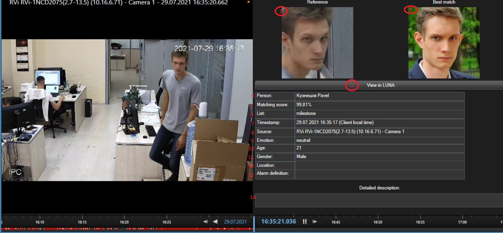
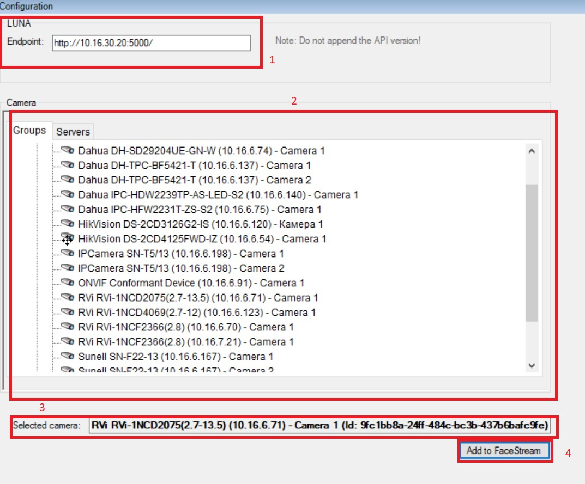
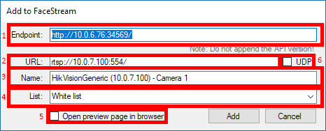

# Milestone Analytics Event Viewer Plug-in
## Introduction
This is a Milestone XProtect Smart Client plugin designed to work in conjunction with VisionLabs LUNA facial recognition system version 3.x that adds preview support for Alarms triggered from LUNA matching events.

The LUNA matching events may be exported to XProtect using [Analytics Event Export plugin](http://git.visionlabs.ru/s.cherepanov/milestone-event-export) for LUNA.

Depending on the environment the plugin is loaded in, it provides different functionality. In Smart Client it adds a detail panel, allowing to see additional information associated with LUNA events by browsing the alarms they trigger.

In Management Client it adds administrative functionality.

## Client Plugin
The plugin add the following preview panel alongside the video display on the `Alarm Manager` tab:
  


The panel displays facial recognition results. The event of recognition is already exported by LUNA and stored in the XProtect Event Server database as an Analytics event. Since events are internal entity, not directly visible to users, this plugin shows corresponding event data for Alarms triggered by those events instead.

> Note, that Alarm rules (aka definitions) should be configured via Management Client prior using this plugin in order to receive and view alarms.

Displayed on the figure:
1. The reference image (one corresponding to the face detection that was selected by VisionLabs video processing software, e.g. FaceStream)
2. The best match image (one from the database, typically stored during enrollment procedure)
3. Shows the LUNA UI face view page (opens browser) for the reference image
4. Recognized person data (customizable via LUNA UI) (if available)
5. Confidence score of the recognition
6. List data (customizable via LUNA UI). This is the list we were looking for a match to the reference photo in
7. Timestamp of the event (displayed in client machine local time)
8. Event source (typically is the name of the camera that took the reference image)
9. Emotion(if enabled in Luna Handler)
10. Age
11. Gender
12. Camera location (if available)
13. Rule that has triggered the alarm
14. Alarm description (this is typically configured on server side)

## Admin Plugin
The plugin adds a new site navigation tree node under MIP Plug-ins category. The Camera configuration sub node adds the following UI:



This UI allows to register ip cameras in LUNA as external clients. This is necessary to determine the source of each recognition event. Each camera should have a unique authentication token, which is assigned upon registration. 

Displayed on the figure:
1. Address of LUNA API installation you wish to access, including protocol and port. Do not include API version here!
2. Camera browser per Milestone server.
3. Camera information panel, displaying:
    * selected camera name and ID (this is the `ObjectID` part of camera `FQID`)
4. Camera control panel, allowing to:
    * add the camera as a new input stream to VisionLabs FaceStream (see details below)

The Add to FaceStream button triggers the following dialog: 



Displayed on the figure:
1. Address of FaceStream installation you wish to access, including protocol and port. Do not include API version here!
2. Camera RTSP stream URL (filled automatically from camera configuration)
3. Stream name (filled automatically locked for editions)
4. List in LUNA to match all the detected faces against
5. Open browser to display FaceStream-generated preview of the newly added stream upon success. If unchecked, will display a simple message box instead.
6. Whether should FaceStream prefer UDP transport for the video stream instead of TCP (which is the default).

> Note, in order to enable the "Add to FaceStream" functionality, you should bind the selected camera with a token first.

## System requirements
The plugin was tested with XProtect version 2018 R3. Older version may work, but are not officially supported.
The plugin supports only 64-bit versions of XProtect Smart Client.

> In order to see the `Alarm Manager` tab in Smart Client, a valid paid license is required.

The Admin plugin supports LUNA API version 4 and requires LUNA v.5.1.0 or newer.  
The Admin plugin supports FaceStream API version 1 and requires FaceStream `???` or newer.

> You may use the admin plugin with older versions of FaceStream, but "Add to FaceStream" functionality will be unavailable.

## Installation
### Developer installation
Copy plugin files to
```
C:\Program Files\Milestone\MIPPlugins\VLAlarmViewer
```
and restart Smart Client.

### End user installation
Run the installer (`VLAlarmViewer.msi`), it will extract the plugin files automatically to:
```
C:\Program Files\Milestone\MIPPlugins\VLAlarmViewer
```
Then restart Smart Client.

## Building
### Requirements
* VisualStudio 2015 Community or newer/better with C# support (make sure to not to disable it when installing)
* Milestone MIP SDK 2018 R3 (probably will compile with older versions, but not tested)
* WIX Toolset version 3.11.1 or later (to build the installer).

### 3rd Party dependencies
This project uses the following external libraries:
* Newtonsoft.Json v. 11.0.2

The dependencies are resolved via NuGet. Visual Studio should do this automatically for you. If it doesn't, run this command in the solution directory:
```
nuget.exe restore VLAlarmViewer.sln
```

If you don't have `nuget.exe`, you can grab the latest version from [here](https://dist.nuget.org/win-x86-commandline/latest/nuget.exe).

### Process
* Open solution and press `build`. That's all.
> Note, the solution assumed default MIP SDK location: `C:\Program Files\Milestone\MIPSDK`

## Foot notes
Make sure Analytics Events are enabled in XProtect. To do so, open Management Client, go to `Tools/Options`, scroll to the `Analytics Events` tab and check `Enabled` under `Analytics events` frame.

Events are not displayed in XProtect UI (Smart Client). Alarms are displayed instead. The alarms are triggered by events according to some rules. The rules are to be defined via Management Client. Expand `Rules and events` tree node, then click on `Analytics events` to bring up the rule editor.

Freeware versions of Smart Client lack the `Event Manager` tab, so a paid version is required.